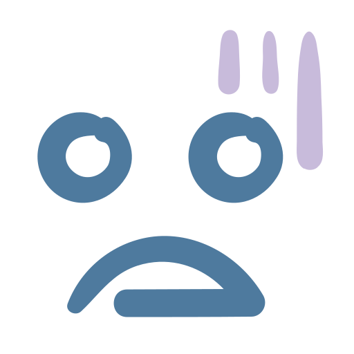

# Project One - JavaScript Browser Game

## Project Overview

First project on the Software Engineering course at General Assembly. The task was to build a simple grid game that can be played in the browser. This was to be a solo project and we were given one week to complete.

 

[Click to play Matchy Match Anime Boys](https://ksaltedsalter.github.io/project-1-memory-game/)

## Table of contents

- [Technologies](#technologies)
- [Setup](#setup)
- [Process](#process)
- [Challenges](#challenges)
- [Wins](#wins)
- [Key Learnings](#key learnings)
- [Future Features](#future features)

## Technologies

Project is created with:

- JavaScript
- HTML
- Sass (SCSS)
- GitHub

## Setup

- Access the source code via the 'Clone or download' button
- Open the index.html file in your browser of choice to start

## Process

I started off by deciding what type of grid game I would like to make. I chose a memory card flipping game as it would allow for some fun styling, use of transformations, sounds and a general love of memory games. I created a very brief sketch of how I wanted the game to look on the browser and what elements would be needed.

 

I started the coding part of this project by creating the grid structure all the ‘cards’ would be based on. This was done on a small scale to begin with so that I could work on functionality first and not get confused with multiple divs. The grid itself was made out of one div, id’ed as the ‘grid’ and contained four ‘card’ divs that had two image tags inside. One image tag acting as the ‘front’ of the card, or the card that would need to be matched to another in the game and the other image tag acting as the ‘back’. All cards would have the same back image.

See below code for one matching set of cards. It is important to note that each pair of cards needed a unique ‘data-framework’. This would be used later to check if they are a matching pair.

```
<div id="grid">
      <div class="card" data-framework="gojo-1">
        
        
      </div>
      <div class="card" data-framework="gojo-1">
        
        
      </div>
<div>

```

I gave my basic grid minimal styling but the cards themselves needed to be styled into their starting position of being face down. This was achieved by using ‘backface-visibility: hidden;’ on both cards and the ‘front’ being rotated 180 degrees, so that it has the illusion of being face down. I created a class called ‘flip’ that has ‘transform: rotateY(180deg);’ but it is not attached to any div or image tag as this will be used later.
The first functionality I worked on was to flip the cards (flipCard).

```
  function flipCard() {
    if (lockBoard) return;
    if (this === firstCard) return;
    this.classList.add("flip");

    if (!hasFlippedCard) {
      hasFlippedCard = true;
      firstCard = this;
    } else {
      hasFlippedCard = false;
      secondCard = this;
      checkForMatch();
    }
  }
```

 When the first card is clicked it adds the ‘flip’ class to it which will rotate the card div 180 degrees and show the face of the card, basically reversing the starting position styling of the cards. The same happens for the second card and the checkForMatch function is run to check the two active cards for a match.

The checkForMatch function checks if the two active cards have the same ‘dataset.framework’. If they do then the cards will stay flipped and become locked so that they cannot be clicked again and a celebratory audio will play. If not, then the flip class is removed, reverting the cards back to face-down and two new cards can be clicked and checked for a match.

Once I was happy with the two previous functions and how they worked I added more cards, up to three pairs, so that it would be easier to check if the shuffle function was successful.
I used the Fisher-Yates (aka Knuth) Shuffle method for the shuffle function. The cards are put into an array. A random index number is then generated between 0 and the length of the array and the current number in the array with that index number gets moved to the end of the array. The length of the array is minused by one and the process is repeated till the array length equals 1. Successfully shuffling the cards.

I then added the remaining card pairs so there were eight in total and worked on how to start and end the game. I thought the best way to achieve this was to use an overlay.  On load of the browser the overlay will pop up with rules and a start button. On start the overlay would be removed by changing the opacity to 0 and the info container (which has the flip count and timer) would show by putting the opacity to 1 and the startGame function would run.

```
  function startGame() {
    let shufflePop = shuffle(cardsArray);
    shufflePop.forEach(function (card) {
      grid.appendChild(card);
    });
    cards.forEach((card) => card.addEventListener("click", flipCard));
    startTime();
  }
```
startGame would run the shuffle function and affix the card divs back into the grid with their new sequence order. It would also start the timer.

To make the game a little more dynamic and fun to play I had a timer function and flip count function.

```
  function flipCount() {
    flips++;
    flipsCounter.innerHTML = flips;
    //if (flips === 1) {
    //}
  }
```
flipCount is activated in the checkForMatch function. Every time two cards are clicked and checked for a match, whether they are or not and count of ‘+1’ would be added to the display in the info-container.

Once all the matches have been found the againPop up function would run which is another overlay that would hide the info-container and display your flip count and time taken to play the game. If the player decides to play again, then the againGame function resets the timer and flip count and re-runs the startGame function so that the cards can be shuffled again and the player has a new randomised board to play with.

To finish it off, I added more styling. The aesthetics I went for were just personally in my tastes as I had not considered an overall colour scheme. I added more sound styling to the start and end of the game, not too much so that it would be an irritant but enough to lean into the overall theme of the game.

## Challenges

- It was my first time working with modals and I had an issue with the layering. At first the modal was underneath the game. This challenge helped me to learn about indexes and how to arrange them.
- During my numerous walk throughs of the game, I noticed that there was an issue with the timer and it was incrementing on the card flips and not the actual seconds taken. This challenge helped me to notice that it matters where functions are being called. I moved where I started the timer and was able to fix that functionality. Unfortunately, that set off a different issue where the timer would continue after the game had finished. I was unable to fix this bug and chose instead to make the timer invisible once the ending modal activated and visible again on replay.

### Wins

- The first time I could get the card to flip and stay flipped if I clicked its match was such a win for me. At this point, I had written two separate functions to flip the card and to check for a match and invoking them to work together was interesting.
- The randomisation function for the cards shuffle was another win. It was a function that I had come across in my research and it was fun to implement something not learnt in class.
- I really enjoyed adding the sound functionality to the game.
- Overall reaching a really good ending place in my game. Being at a point where I wanted to add extra features gave me a good sense of time management in coding projects and showed me what I was able to achieve in a week.

## Key Learnings
- Research is key. It was interesting and beneficial to learn lots of little elements and use them together in one project.
- This project gave me a good idea of timing when reading code. I was happy with my stopping point but it showed me what I could achieve in a restricted time frame and how best to plan for it.
- On viewing others games in our presentation session, it really showed me the many different routes that could be taken when given an initial starting point of ‘build a grid game’. 

## Future Features

- My first main fix would be the timer bug that I discuss in the Challenges.
- I would add another level with a different card set. This would make the game itself more interesting.
- I wanted the timer to pulse on every second but was unable to figure out how to do this without the grid div bouncing the cards as well.
